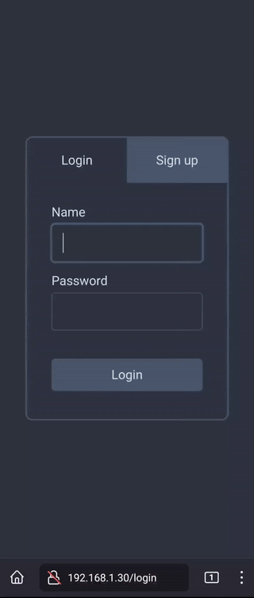

# Chat

A global chat room, comprised of the server-side code and the web client
implementation.

Currently running on an AWS EC2 instance. The web client is available
**[here](http://ec2-13-57-232-164.us-west-1.compute.amazonaws.com)**.

Documentation coming soon!